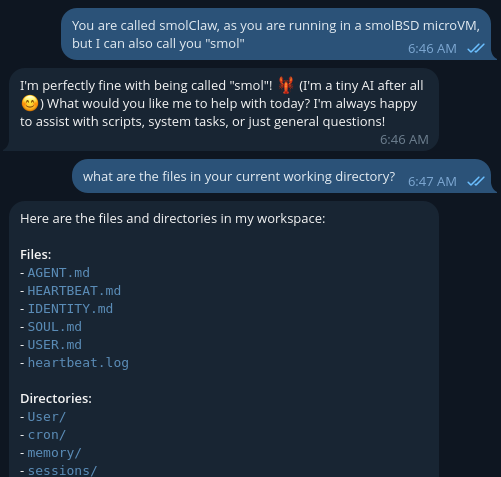

<div align="center" markdown="1">

**Running smolClaw with ollama**



</div>

Refer to [this guide][1] to prepare your local model for tooling.

I run this setup with [qwen3:8b][2] modified as explained in the linked guide, renamed `qwen3-agentic:latest`.

Example [picoclaw][3] `config.json`, modify:

* `YOUR_TELEGRAM_TOKEN`, on Telegram, create a `/newbot` speaking to `@BotFather`
* Ollama's IP address

```json
{
  "agents": {
    "defaults": {
      "workspace": "~/.picoclaw/workspace",
      "restrict_to_workspace": false,
      "provider": "ollama",
      "model": "ollama/qwen3-agentic:latest",
      "max_tokens": 8192,
      "temperature": 0.7,
      "max_tool_iterations": 20
    }
  },
  "channels": {
    "telegram": {
      "enabled": true,
      "token": "YOUR_BOT_TOKEN",
      "allow_from": ["YOUR_USER_ID"]
    }
  },
  "providers": {
    "ollama": {
      "api_base": "http://192.168.0.10:11434/v1",
      "api_key": "-"
    }
  },
  "gateway": {
    "host": "0.0.0.0",
    "port": 18790
  },
  "tools": {
    "web": {
      "brave": {
        "enabled": false,
        "api_key": "",
        "max_results": 5
      },
      "duckduckgo": {
        "enabled": true,
        "max_results": 5
      }
    }
  },
  "heartbeat": {
    "enabled": true,
    "interval": 30
  }
}
```

[1]: https://gist.github.com/Hegghammer/86d2070c0be8b3c62083d6653ad27c23
[2]: https://ollama.com/library/qwen3:8b
[3]: https://github.com/sipeed/picoclaw
