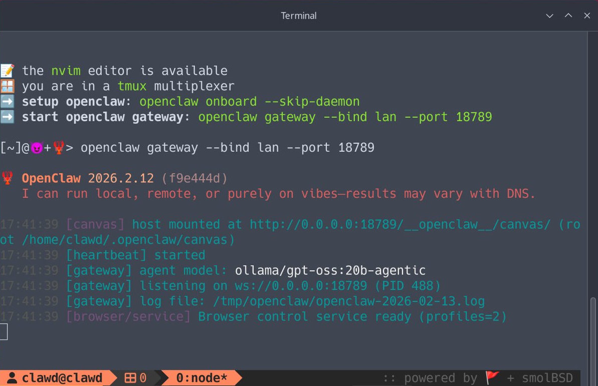

<div align="center" markdown="1">


# smolClaw



[picoclaw][1] running on a microVM!

</div>

**smolClaw** is a [smolBSD][2] microVM appliance that runs
[picoclaw][1] on Linux or macOS.

Running picoclaw inside a microVM provides:

* Minimal footprint
* Strong isolation of memory and filesystem
* Fast startup (under one second)

As per the [smolBSD][2] design, the VM boots directly into a `tmux`
console with default bindings running `bash`.

# Quickstart

* Fetch [smolBSD][2] and install dependencies

```sh
git clone https://github.com/NetBSDfr/smolBSD
```
Debian, Ubuntu and the like
```sh
sudo apt install curl git bmake qemu-system-x86 sudo binutils libarchive-tools gdisk socat
```
macOS
```sh
brew install curl git bmake qemu binutils libarchive
```

* Build the picoclaw image

```sh
cd smolBSD
./docker2svc.sh dockerfiles/Dockerfile.clawd
```

* Run the microVM

```sh
./startnb.sh -c 2 -m 1024 -f etc/clawd.conf
```

Options:

- `-c` → CPU cores
- `-m` → RAM in MB

To share a host directory:

```sh
./startnb.sh -c 2 -m 1024 -f etc/clawd.conf -w /path/to/directory
```

Inside the VM it will be mounted at:

```
/mnt
```

* Once the microVM has started, begin onboarding

```sh
clawd🦞 openclaw onboard
```

* When the configuration is finished, start the gateway

```sh
clawd🦞 openclaw gateway
```

[picoclaw][1] Quickstart is available [here](https://github.com/sipeed/picoclaw/?tab=readme-ov-file#-quick-start)

---
### Troubleshooting "Could not access KVM kernel module: No such file or directory"
The error says KVM (hardware virtualization) isn't available. This usually means either:

1. KVM module isn't loaded:
```sh
sudo modprobe kvm kvm_intel   # for Intel CPUs
# or
sudo modprobe kvm kvm_amd     # for AMD CPUs
```
Then check it's there:
```sh
ls /dev/kvm
```

2. Virtualization is disabled in your BIOS/UEFI
If modprobe fails, reboot into BIOS and enable "Intel VT-x" or "AMD-V" (sometimes called "SVM Mode"). It's usually under CPU settings or Advanced.

You can check if your CPU supports it at all with:
```sh
grep -Ec '(vmx|svm)' /proc/cpuinfo
```
If that returns 0, either it's disabled in BIOS or your CPU doesn't support it.

3. Are you inside a VM already?
If you're running Ubuntu inside a VM (like VirtualBox or VMware), you need to enable nested virtualization in the hypervisor's settings. For VirtualBox that's "Enable Nested VT-x/AMD-V" in the VM's system settings.


[1]: https://github.com/sipeed/picoclaw
[2]: https://smolBSD.org
