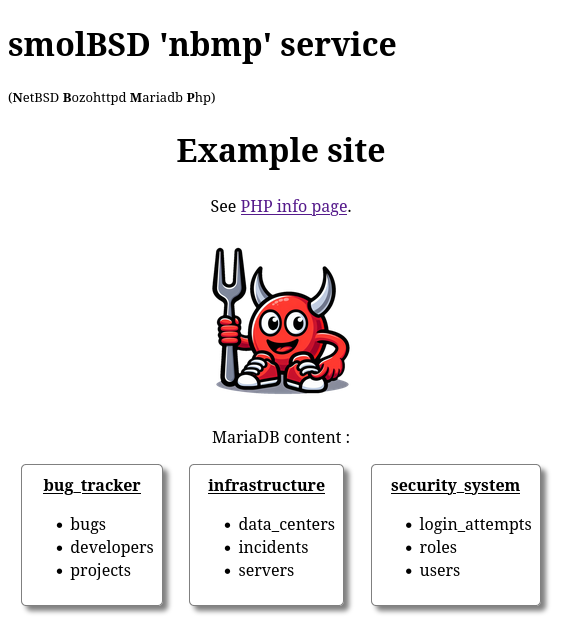

# NBMP

## Introduction

"NBMP" stands for "NetBSD Bozohttpd Mariadb PHP". It's the equivalent of "LAMP" term for "Linux Apache MariaDB PHP" used for web developpment.

This humble service provides these programs and minimal dependencies to let you do some web developpement, tests, POC, etc... on smolBSD. By default, NBMP uses the last available version of PHP but you can provide the version you want at launch time.

Because of all these dependencies the first launch of a microvm takes some time as well as the start of MariaDB compared with the speed of smolBSD. The next launches are faster except if you want a new version of PHP for an existent microvm : new packages (PHP and dependencies) will take time to dowload and install (see [§Provide PHP version to use](#provide-php-version-to-use)).

Moreover, each launch drops existing databases and loads your own `.sql` files in MariaDB. So, the time to arrival is stretched (see [§No drop databases at launch](#no-drop-databases-at-launch) to avoid it).

But, if you are using an already created microvm without specify PHP version and without delete databases, the boot is relatively fast !

`www` and`.sql` files are stored in a local folder on your filesystem. It is mounted on the microvm to `/mnt` and bozohttpd has his `slashdir` (like Apache "DocumentRoot" folder) on it. Consequently, every file you put/change/delete into it, is instantly put/changed/deleted into the microvm.

> [!CAUTION]
> Do not use this service for prod. No security stuff are set.

## Prerequisites
NBMP stack offered by this service provides packages :
- php
- php-curl
- php-mysqli
- php-pdo
- php-pdo_mysql 
- mariadb-server
- mariadb-client
- bozohttpd

Also, feel free to edit `etc/nbmp.conf` file as needed.

Concerning your web developpement files :
- put your `.sql` files in the `service/nbmp/files/sql` folder
- put your `www` files (`.php`, `.html`, `.css`, etc...) in `service/nbmp/files/www`

`index.php`, `info.php` as well as `.sql` scripts coming with this service stand for example and can be deleted.

## Usage
Building on GNU/Linux or MacOS
```sh
$ bmake SERVICE=nbmp build
```
Building on NetBSD
```sh
$ make SERVICE=nbmp base
```

Start the service:
```sh
./startnb.sh -f etc/nbmp.conf -d
```

Finally, go to [http://localhost:8181](http://localhost:8181) and enjoy!


<div align="center" markdown="1"></div>
This is the example index page.


## To go further
### System console
You can have access to the system console keeping microvm foreground.  Don't use `-d` option (for "daemonize") with `./startnb.sh`. After shutdown or to quit the microvm, press `Ctrl+a x`. Avoid quitting microvm before system shuts down correctely, otherwise the next boot will performs auto repaire actions on filesystem and MariaDB does not appreciate that.

If the microvm is launched via [smolBSD VM Manager](https://github.com/NetBSDfr/smolBSD/tree/main/app), you can clic on the terminal icon to get access to the console. Otherwise, or if it launched "daemonized", you can use :

```sh
telnet localhost 5556
```

See `etc/nbmp.conf` file if you want to change `serial_port` value. 

> [!IMPORTANT]
> Only one connection at a time is permit.

### MariaDB console
For your application dev/debugging sessions, use the microvm console to get access to the MariaBD console with `mariadb` command. This connection is made with the unix socket, so no password is required.

### Logs
If you want to check logs from MariaDB and PHP, go to `/mnt/logs` folder into microvm or `service/nbmp/files/logs` into your filesystem. It's finally the same location : one is mounted on the other.

MariaDB logs are stored in `/mnt/logs/mariadb.log` into microvm or `service/nbmp/files/logs/mariaDB.log` into your filesystem. To change it, edit `/etc/rc.d/mariadb` to modify `--log-error` value.

PHP errors are displayed in the web pages and written into the `/mnt/logs/php.log` file into microvm or `service/nbmp/files/logs/php.log` into your filesystem. To change it, edit `display_errors` and `error_log` variables in `/usr/pkg/etc/php/8.4/php.ini`.

For theses logs behaviors, if you want your changes to be persistent for each microvm creation, edit `service/nbmp/etc/rc` file.

### Provide PHP version to use
See [http://cdn.netbsd.org/pub/pkgsrc/packages/NetBSD/x86_64/11.0/All/](http://cdn.netbsd.org/pub/pkgsrc/packages/NetBSD/x86_64/11.0/All/) to check PHP version you want and :
```sh
./startnb.sh -f etc/nbmp.conf -d -e PHP=8.3
```

### No drop databases at launch
Each microvm launch drops all databases by default. If you want to keep existing data, use :
```sh
./startnb.sh -f etc/nbmp.conf -d -e nodeletesql=yes
```

Service made with ❤.
